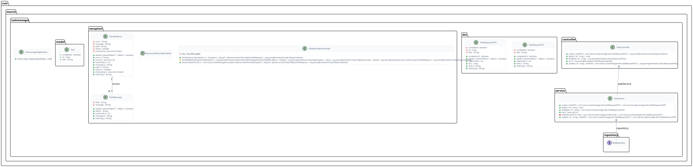

# TaskManager API

[](https://www.oracle.com/java/)
[](https://spring.io/projects/spring-boot)
[](#)

[Português](#portuguese) | [English](#english)

---

<a name="portuguese"></a>

## Português

Projeto simples de API REST desenvolvido com Spring Boot como primeiro contato com o ecossistema Java back-end.

A aplicação é um gerenciador de tarefas com operações básicas de CRUD, validação de dados e tratamento padronizado de erros.

### Tecnologias

- **Java 17**
- **Spring Boot 3**
- **Spring Data JPA**
- **H2 Database**
- **Bean Validation**
- **SpringDoc OpenAPI (Swagger)**

### O que foi aplicado

- Separação em camadas (Controller, Service, Repository)
- Uso de DTOs com Java Records
- Validação de dados de entrada
- Tratamento global de exceções
- Mapeamento explícito de entidades

### Estrutura

```text
src/main/java/com/marcio/taskmanager/
├── controller/   # Endpoints da API
├── service/      # Regras de negócio
├── repository/   # Comunicação com o banco
├── model/        # Entidades JPA
├── dto/          # Objetos de transferência (Records)
└── exception/    # Handlers de erro global
```

### Modelagem de Classes

O diagrama de classes abaixo ilustra a arquitetura interna do sistema e a relação entre as camadas. Este diagrama é gerado automaticamente a partir do código-fonte compilado.



### Endpoints

- `GET /tasks` — Lista todas as tarefas
- `GET /tasks/{id}` — Busca por ID
- `POST /tasks` — Cria uma tarefa

```json
{
  "title": "Aprender Spring Boot",
  "completed": false
}
```

> **Validações:** `title` é obrigatório e deve ter entre **5 e 100 caracteres**.

- `PUT /tasks/{id}` — Atualiza uma tarefa
- `DELETE /tasks/{id}` — Remove uma tarefa

### Como executar

1. **Pré-requisito:** Java 17
2. **Clone:**
   ```bash
   git clone https://github.com/MarcioRosendoF/task-manager-api.git
   ```
3. **Execute:**
   ```bash
   ./mvnw spring-boot:run
   ```
4. **Acesse a Documentação:**
   [http://localhost:8080/swagger-ui/index.html](http://localhost:8080/swagger-ui/index.html)

### Interface Web

Frontend em React consumindo esta API: [Task Manager Frontend](https://github.com/MarcioRosendoF/task-manager-frontend)

### Próximos Passos

Para futuras iterações e novos projetos, o foco será em:

- Implementação de segurança com Spring Security e JWT.
- Containerização da aplicação com Docker.
- Persistência em bancos de dados relacionais externos (PostgreSQL/MySQL).
- Cobertura de testes unitários e de integração com JUnit e Mockito.

---

<a name="english"></a>

## English

Simple REST API built with Spring Boot as a first project in the Java back-end ecosystem.

The application is a task manager with basic CRUD operations, input validation, and standardized error handling.

### Tech stack

- **Java 17**
- **Spring Boot 3**
- **Spring Data JPA**
- **H2 Database**
- **Bean Validation**
- **SpringDoc OpenAPI (Swagger)**

### What’s covered

- Layered structure (Controller, Service, Repository)
- DTO usage with Java Records
- Input validation
- Global exception handling
- Explicit entity mapping

### Class Diagram

The class diagram below illustrates the internal architecture of the system and the relationships between layers. It is automatically generated from the compiled source code.


### Endpoints

- `GET /tasks`
- `GET /tasks/{id}`
- `POST /tasks`

```json
{
  "title": "Learn Spring Boot",
  "completed": false
}
```

> **Validation:** `title` is required and must be between **5 and 100 characters**.

- `PUT /tasks/{id}`
- `DELETE /tasks/{id}`

### How to run

1. **Requirement:** Java 17
2. **Clone:**
   ```bash
   git clone https://github.com/MarcioRosendoF/task-manager-api.git
   ```
3. **Run:**
   ```bash
   ./mvnw spring-boot:run
   ```
4. **Access Documentation:**
   [http://localhost:8080/swagger-ui/index.html](http://localhost:8080/swagger-ui/index.html)

### Web Frontend

React frontend consuming this API: [Task Manager Frontend](https://github.com/MarcioRosendoF/task-manager-frontend)

### Future Steps

For future iterations and new projects, the focus will be on:

- Security implementation with Spring Security and JWT.
- Application containerization with Docker.
- Persistence in external relational databases (PostgreSQL/MySQL).
- Unit and integration testing coverage with JUnit and Mockito.

---

## About me / Sobre mim

Este projeto marca meu início no desenvolvimento back-end com Java. Venho de uma base sólida com C# e Unity, principalmente em lógica de sistemas e organização de código.

This project marks my starting point in Java back-end development. I come from a C# and Unity background, focused on system logic and code structure.

---

Developed by [Marcio](https://github.com/MarcioRosendoF)
